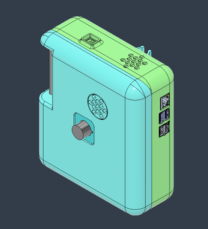
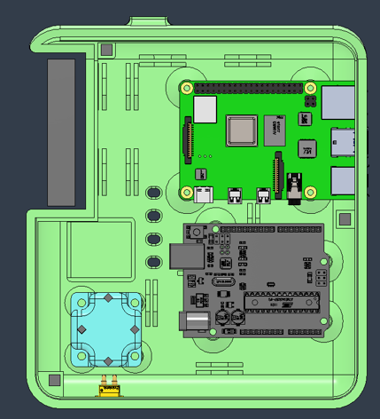
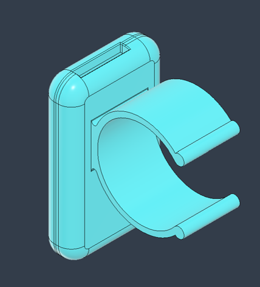
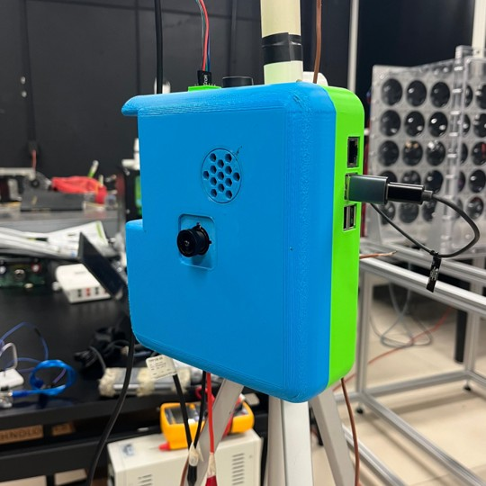
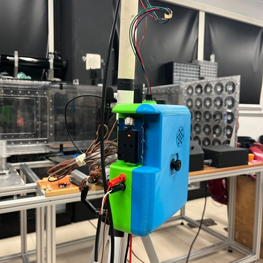
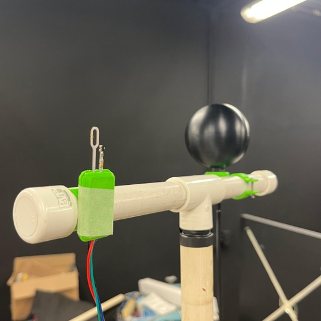

# Diseño y construcción del DTHIS-C {#cap-construccion}

El desarrollo de un dispositivo de monitoreo ambiental requiere no solo la selección de sensores adecuados, sino también un proceso de diseño que garantice la integración de todos los componentes electrónicos, mecánicos y de software. En este capítulo se presenta la etapa de diseño y construcción del DTHIS-C, donde se abordan los criterios técnicos que guiaron la elección de los sensores y microcontroladores, así como el acondicionamiento de señal necesario para obtener mediciones confiables.

Asimismo, se describe la arquitectura general del sistema, representada mediante diagramas de conexión y de bloques que ilustran la interacción entre los diferentes módulos. Se detallan los procesos de configuración y programación, orientados a lograr la adquisición y transmisión de datos hacia la plataforma IoT.

Finalmente, se expone el diseño físico del dispositivo, incluyendo la elaboración de modelos CAD, la impresión 3D de la carcasa y la organización interna de los componentes. De esta manera, el capítulo proporciona el marco completo que permite comprender cómo las decisiones de diseño se tradujeron en la construcción de un dispositivo funcional, portátil y accesible para la evaluación del confort en espacios interiores.

El capítulo siguiente aborda la calibración y validación de los sensores que conforman el DTHIS-C, con el fin de garantizar la exactitud y confiabilidad de las mediciones obtenidas en condiciones reales de operación.

## Descripción del dispositivo {#sec-descripcion}

La arquitectura del DTHIS-C se ha fundamentado en el uso combinado de la Raspberry Pi 4 y el Arduino Uno WiFi Rev2, microcontroladores seleccionados por las siguientes características y ventajas:

1. **Versatilidad y capacidad de procesamiento:**  
   La Raspberry Pi 4, proporciona una plataforma robusta para el procesamiento avanzado de datos y la ejecución de algoritmos complejos. Su flexibilidad, junto con la facilidad de integración de diversas funcionalidades, permite adaptar el sistema a requerimientos específicos y configurar el rendimiento según las demandas del entorno.

2. **Conectividad:**  
   Ambos dispositivos cuentan con conectividad a Internet, lo que posibilita la transmisión en tiempo real de datos hacia una base de datos remota alojada en el servidor ThingsBoard.

3. **Compatibilidad y ecosistema abierto:**  
   La adopción de tecnologías abiertas facilita la integración y reproducibilidad del sistema. La amplia comunidad de desarrolladores que respalda tanto la Raspberry Pi como el Arduino asegura soporte continuo, actualizaciones regulares y una extensa variedad de recursos y librerías, lo que se traduce en mayor flexibilidad para adaptar el sistema a diversas necesidades y entornos.

4. **Accesibilidad:**
   Frente a equipos especializados, la utilización de estos microcontroladores constituye una solución rentable sin comprometer el rendimiento ni la fiabilidad del sistema. Además, el Arduino UNO WiFi Rev2 y el Raspberry Pi 4 Model B son fáciles de conseguir en México, disponibles en tiendas como AG Electrónica y 330ohms, con precios aproximados de $1,300.00 MXN y $2,000.00 MXN, respectivamente. Esto facilita la replicación del proyecto.

En la @tbl-componentes se presentan los sensores y componentes electrónicos que conforman el DTHIS-C, detallándose la variable que mide cada sensor, el modo de comunicación, la conexión al microcontrolador correspondiente y si requieren acondicionadores de señal.

| **Sensor**                                    | **Variable**                       | **Comunicación** | **Microcontrolador**     | **Acondicionador de señal**  |
|-----------------------------------------------|------------------------------------|------------------|--------------------------|------------------------------|
| Termopar tipo T                               | Temperatura del aire               | SPI              | Arduino UNO WiFi Rev2    | PWFusion MAX31856 SEN-30007	|
| TPF1/E-20 PT1000                              | Temperatura radiante               | SPI              | Arduino UNO WiFi Rev2    | Adafruit PT1000 RTD-MAX31865 |
| Wind Sensor Rev P6                            | Velocidad del viento		           | ADC              | Arduino UNO WiFi Rev2    |				                      |
| SCD30 Sensirion                               | CO2 y humedad relativa  | I2C              | Raspberry Pi 4 Model B   |				                      |
| Micrófono ambiental USB                       | Sonido                             | USB              | Raspberry Pi 4 Model B   |                              |
| 5MP OV5647 Wide Angle Fisheye Camera          | Iluminancia                        | CSI              | Raspberry Pi 4 Model B   |				                      |
: Sensores y componentes electrónicos que constituyen al DTHIS-C. {#tbl-componentes .hover .sm}

### Diseño

En la @fig-bloques se presenta el diagrama de bloques del DTHIS-C, el cual integra los diferentes sensores, microcontroladores y acondicionadores de señal que permiten la adquisición de las variables ambientales.

{.lightbox #fig-bloques width=80%}

El sistema se organiza en torno a dos microcontroladores: Arduino UNO WiFi Rev2 y Raspberry Pi 4 Model B. El primero se encarga de la adquisición de las señales analógicas y digitales provenientes de los termopares tipo T (para temperatura del aire), el TPF1/E-20 PT1000 (para temperatura radiante) y el Wind Sensor Rev. P6 (para velocidad del viento). En el caso de los termopares y del PT1000, las señales requieren acondicionamiento, por lo que se emplean los módulos MAX31856 y MAX31865, respectivamente, que realizan funciones de linealización, compensación y conversión de las señales.

La Raspberry Pi 4 se destina a la gestión de sensores que utilizan protocolos de comunicación digitales. A través de I2C se conecta el sensor SCD30, encargado de medir la concentración de CO2 y humedad relativa. Por medio del puerto USB se incorpora el micrófono ambiental, que registra los niveles de sonido. Asimismo, mediante la interfaz CSI se integra la cámara Arducam 5MP OV5647 Fisheye, utilizada para estimar la iluminancia.

Ambos microcontroladores reciben energía mediante un regulador DC-DC de 10 W, que convierte la entrada de 5 V de corriente directa desde el cable de alimentación en la tensión necesaria para el funcionamiento de cada microcontrolador y de igual manera otro con entrada a 5 V y salida a 12 V, instalado específicamente para el Wind Sensor Rev. P6, que requiere dicho voltaje para su correcto funcionamiento.

### Carcasa

Para el diseño del DTHIS‑C se optó por una carcasa que alberga de forma ordenada y protegida todos los componentes electrónicos, sensores y microcontroladores. Al tratarse de un dispositivo de campaña, resultaba imprescindible un diseño ligero y robusto que permitiera un transporte sencillo y un montaje rápido sobre un trípode.

La carcasa (@fig-dimensiones) presenta unas dimensiones aproximadas de 160 × 180 × 65 mm, lo que proporciona el espacio suficiente para integrar la Raspberry Pi 4, el Arduino UNO WiFi Rev2, los módulos de acondicionamiento de señal y la fuente de alimentación, además de los sensores internos como el SCD30 y el TPF1/E-20 PT1000. Su tamaño compacto permite mantener un peso reducido, facilitando la portabilidad, mientras que el material de fabricación asegura la resistencia mecánica necesaria para proteger los componentes durante el transporte y el uso en campaña.

{.lightbox #fig-dimensiones width=70%}

El modelado 3D de la carcasa se llevó a cabo en `Autodesk Fusion`, atendiendo a tres objetivos principales:

- Protección: Cada componente (sensores, electrónica y microcontroladores) se ubica en su propio compartimento para evitar impactos y vibraciones.
- Montaje: La pieza principal incorpora un anclaje rápido al trípode, así como acoples para el tubo de PVC que sostiene los termopares a alturas de 1.7 m, 1.1 m, 0.6 m y 0.1 m, y los aros de sujeción para el Wind Sensor Rev P6 y el TPF1/E‑20.
- Mantenimiento: La geometría de la tapa y los soportes permite un acceso ágil para reemplazar o ajustar cualquier sensor sin desmontar todo el conjunto.

Además de la carcasa principal, se diseñaron fundas individuales para:

- Cámara fisheye  
- Regulador de voltaje
- Wind Sensor Rev P6 (aros de sujeción al tubo)  
- TPF1/E‑20 (aros de sujeción al tubo)  

La @fig-diseno-3d muestra la carcasa principal y las piezas complementarias que protegen cada módulo y simplifican su fijación al soporte de PVC.

::: {#fig-diseno-3d layout-ncol=3 layout-nrow=2}
{group="diseno-3d" #fig-carcasa-exterior}

{group="diseno-3d" #fig-carcasa-interior}

{group="diseno-3d" #fig-carcasa-camara}

{group="diseno-3d" #fig-carcasa-voltaje}

{group="diseno-3d" #fig-carcasa-tpf1}

{group="diseno-3d" #fig-carcasa-wind}

Diseño 3D de la carcasa y componentes asociados.
:::

Para su impresión se empleó el filamento ASA por su alta resistencia a los rayos UV, garantizando durabilidad. Para la impresión se utilizó un infill del 10%, patrón cúbico y giroide (acorde a la pieza) y 4 perímetros.

### Ensamblaje

Para garantizar un sistema modular, fácil de transportar y sencillo de mantener, se integró la electrónica complementaria (@tbl-electronica) dentro de la carcasa principal de la siguiente manera:

- Reguladores de voltaje: Se instalaron dos convertidores buck. Uno con entrada y salida a 5 V para alimentar la Raspberry y el Arduino; y otro con entrada a 5 V y salida a 12 V específicamente para el Wind Sensor, que requiere 12 V para un funcionamiento correcto.

- Conectores banana hembra: Se emplearon dos conectores banana hembra para la conexión desmontable del TPF1 al amplificador PT1000, facilitando el montaje y desmontaje rápido del sensor.

- Perfboard y pines macho: El Wind Sensor se conecta a un perfboard de 4 canales al que se soldaron cuatro pines macho de 5 × 2.54 mm. Desde allí, un cable con pines hembra permite enchufar directamente el sensor al regulador de 12 V.

- Conexiones directas: El resto de los sensores y módulos se conectan mediante cables al propio puerto USB (micrófono), al bus I2C (SCD30) o al conector CSI (cámara), según corresponda.

| Cantidad | Componente                       |
| ---------| -------------------------------- |
| 1        | Convertidor buck 10 W, 5 V DC    |
| 1        | Convertidor buck 5 V → 12 V DC   |
| 2        | Conectores banana hembra         |
| 1        | Conector XT30 hembra             |
| 1        | Perfboard de 4 canales (5 pines) |
| 4        | Pines macho 5 × 2.54 mm          |
| 1        | Ventilador de 5 V                |
: Componentes utilizados para la electrónica complementaria del DTHIS-C. {#tbl-electronica .hover .sm}

La @fig-diseno-final ilustra el montaje completo del DTHIS‑C: la carcasa principal fijada al trípode, la extensión de altura realizada con un tubo de PVC y los termopares distribuidos a sus respectivas alturas. En la @fig-dthis-4 se aprecia, en la parte superior del tubo, el Wind Sensor a la izquierda y el TPF1 a la derecha, ambos asegurados mediante sus aros de sujeción.

::: {#fig-diseno-final layout-ncol=2 layout-nrow=2}
{group="diseno-final" #fig-dthis-1}

{group="diseno-final" #fig-dthis-2}

{group="diseno-final" #fig-dthis-3}

{group="diseno-final" #fig-dthis-4}

Diseño final del DTHIS-C tras haber impreso y ensamblado todos los componentes.
:::

### Lógica de programación

En la @fig-flujo se muestra la lógica de programación implementada en el DTHIS-C. El flujo comienza con la acción del usuario, quien inicia la campaña de medición a través del dispositivo. Una vez activado, el DTHIS-C ejecuta de manera continua la medición de variables ambientales (temperatura del aire, temperatura radiante, humedad relativa, velocidad del viento, concentración de CO2, iluminancia y niveles de sonido) a partir de los sensores integrados.

Posteriormente, el dispositivo procede al envío de los datos obtenidos hacia la plataforma IoT ThingsBoard, donde estos son almacenados en una base de datos para su gestión y análisis posterior. Una vez registrados, la plataforma actualiza el tablero de visualización, mostrando en tiempo real las condiciones del entorno monitoreado.

Finalmente, el usuario tiene la posibilidad de finalizar la campaña, con lo cual el dispositivo detiene el envío de información y concluye el proceso. Esta lógica asegura un ciclo de medición y transmisión continua durante todo el tiempo en que la campaña permanezca activa.

{.lightbox #fig-flujo width=60%}

### Tablero interactivo

Para facilitar el seguimiento y análisis de las campañas de medición, el DTHIS‑C se integra con la plataforma IoT, `ThingsBoard`, que actúa como repositorio central de todos los datos ambientales capturados. Cada lectura (temperatura, humedad, CO2, luminancia, velocidad del viento o nivel de sonido) se publica en tiempo real, donde puede filtrarse y descargarse según el intervalo temporal, la variable o el volumen de datos requerido.

Con el fin de ofrecer una supervisión inmediata en campo, se ha diseñado un tablero interactivo (@fig-tablero) que combina:

- Tarjetas de valores instantáneos, que muestran al momento la última lectura de cada variable.

- Gráficos de series temporales, que permiten visualizar la evolución histórica de las mediciones y detectar tendencias o anomalías.

Este entorno visual garantiza una rápida interpretación de la información y podría apoyar a la toma de decisiones durante las campañas de confort interior.

{.lightbox #fig-tablero width=80%}

## Componentes {#sec-componentes}

### Arduino UNO WiFi Rev2

El Arduino UNO WiFi Rev2 es una placa de microcontrolador diseñada para proyectos de Internet de las Cosas (IoT), integrando conectividad WiFi y Bluetooth mediante el módulo u-blox NINA-W102 y un sensor IMU de 6 ejes (LSM6DS3TR) para detección de movimientos. Equipada con el microcontrolador ATmega4809, mantiene compatibilidad con el formato estándar UNO, facilitando su uso con shields existentes [Arduino, -@arduino].

En la @tbl-arduino se muestran las especificaciones del Arduino UNO WiFi Rev2.

| **Parámetro**              | **Detalle**                                   |
|----------------------------|-----------------------------------------------|
| Microcontrolador           | ATmega4809                                    |
| Memoria flash              | 48 KB                                         |
| SRAM                       | 6,144 Bytes                                   |
| EEPROM                     | 256 Bytes                                     |
| Conectividad Wi-Fi         | Sí, u-blox NINA-W102 (2.4 GHz)                |
| Bluetooth                  | Sí, Bluetooth Low Energy                      |
| Sensor IMU                 | Sí, LSM6DS3TR (6 ejes)                        |
| Pines digitales I/O        | 14 (5 PWM)                                    |
| Pines analógicos           | 6                                             |
| Voltaje de operación       | 5 V                                            |
| Consumo máximo total       | 200 mA                                        |
| Dimensiones                | 68.6 mm x 53.4 mm                             |
: Especificaciones del Arduino UNO WiFi Rev2. {#tbl-arduino .hover .sm}

### Raspberry Pi 4 Model B

La Raspberry Pi 4 Model B es una computadora de placa única de alto rendimiento, diseñada para tareas de procesamiento avanzado y conectividad eficiente en un formato compacto. Equipada con un procesador de 64 bits de cuatro núcleos y opciones de RAM de hasta 8 GB, ofrece soporte para salida de video dual 4K y conectividad avanzada mediante Wi-Fi de doble banda, Bluetooth 5.0, Ethernet Gigabit y puertos USB 3.0, con capacidad para Power over Ethernet (PoE) mediante un accesorio adicional. Su diseño versátil y eficiente la hace ideal para la integración y gestión de datos en el sistema DTHIS-C [Raspberry, -@raspberry].

En la @tbl-raspberry se muestran las especificaciones de la Raspberry Pi 4 Model B.

| **Parámetro**              | **Detalle**                                     |
|----------------------------|-------------------------------------------------|
| Procesador                 | Broadcom BCM2711, 4 núcleos Cortex-A72, 1.5 GHz |
| Memoria RAM                | 8 GB (LPDDR4-3200)                              |
| Conectividad Wi-Fi         | Sí, dual-band 2.4 GHz y 5 GHz, 802.11ac         |
| Bluetooth                  | Sí, Bluetooth 5.0                               |
| Puertos USB                | 2 USB 3.0, 2 USB 2.0                            |
| Salida de video            | 2 micro HDMI, soporte dual 4K 60 fps            |
| Ethernet                   | Gigabit                                         |
| Almacenamiento             | Tarjeta microSD                                 |
| Voltaje de operación       | 5 V                                             |
| Consumo energético         | Eficiente, sin ventilador (~3 A recomendado)    |
| Dimensiones                | 85.6 mm x 56.5 mm x 17 mm                       |
: Especificaciones del Raspberry Pi 4 Model B. {#tbl-raspberry .hover .sm}

### Temperatura del aire {#sec-taire-a}

#### Termopar Tipo T 

En la construcción del DTHIS-C se emplean cuatro termopares tipo T, los cuales son sensores de temperatura compuestos por la unión de cobre y cobre-níquel (constantán). Su uso es ideal para entornos con humedad.

De acuerdo con la norma ASHRAE-55, la medición de la temperatura del aire en espacios interiores debe realizarse a diferentes alturas dependiendo de la postura del ocupante: 0.1 m, 0.6 m y 1.1 m para ocupantes sentados, y 0.1 m, 1.1 m y 1.7 m para ocupantes de pie. Estas alturas representan, respectivamente, los niveles aproximados de tobillos, cintura y cabeza, y permiten evaluar la temperatura media del aire, limitando la diferencia de temperatura entre cabeza y tobillos a un máximo recomendado para garantizar condiciones de confort [ASHRAE-55, -@ashrae55].

En la @tbl-termopar se muestran las especificaciones principales del termopar tipo T acorde a @omega.

| **Parámetro**                              | **Detalle**                      |
|--------------------------------------------|----------------------------------|
| Rango de temperatura (grado de termopar)   | -200 a 350°C (-328 a 662°F)      | 
| Límite de error por encima de 0 °C         | ±1.0°C o ±0.75% del valor medido |
| Límite de error por debajo de 0 °C         | ±1.0°C o ±1.5% del valor medido  |
: Especificaciones del Termopar Tipo T. {#tbl-termopar .hover .sm}

#### PWFusion MAX31856 SEN-30007

El PWFusion MAX31856 SEN-30007 (@fig-MAX31856) es un shield de termopares de cuatro canales diseñado para integrarse con la plataforma Arduino. Este dispositivo se conecta directamente a la placa de desarrollo. El módulo acondiciona la señal proveniente de termopares, realizando el procesamiento necesario para adaptar y amplificar la señal eléctrica, la cual se caracteriza por su bajo voltaje.

{.lightbox #fig-MAX31856 width=70%}

Acorde a @pwf sus específicaciones son las siguientes:

- Conversión de señal analógica a digital con resolución de 19 bits.
- Interfaz SPI de 4 hilos.
- Rango de voltaje de alimentación: 3.3 V a 5.0 V.  

### Temperatura radiante {#sec-trad-a}

#### Fuehler Systeme TPF1/E-20 PT1000
Se empleó el TPF1/E-20 PT1000, diseñado para medir la temperatura radiante en un rango de temperaturas de -30°C a +75°C. Su sonda de temperatura, basada en la tecnología PT1000, se puede montar como un péndulo libremente suspendido, lo que permite obtener mediciones exactas de la temperatura de sensación térmica en entornos donde la convección natural y la estratificación del aire pueden influir en los resultados [FuehlerSysteme, -@fuehler].

En la @tbl-pt1000 se muestran las especificaciones del sensor TPF1/E-20 PT1000.

| **Parámetro**              | **Detalle**                                                                  |
|-----------------------------|-----------------------------------------------------------------------------|
| Rango de temperatura        | -30 °C a +75 °C                                                             |
| Tipo de circuito            | Conexión de 2 hilos                                                         |
| Corriente de medición       | ~1 mA                                                                       |
| Conexión eléctrica          | Extremos pelados con terminales                                             |
| Cable                       | PVC (2×0,25 mm2, temperatura máxima +105°C), longitudes variables|
| Resistencia de fuga         | >100 M$\Omega$ a +20 °C (500 V DC)                                          |
| Material del globo          | Aluminio pintado en negro                                                   |
| Dimensiones del globo       | Diámetro 70 mm                                                              |
: Especificaciones del TPF1/E-20 PT1000. {#tbl-pt1000 .hover .sm}

#### Adafruit PT1000 RTD-MAX31865

El PT1000 RTD-MAX31865 es un convertidor de resistencia a digital. La @fig-MAX31865 muestra el diagrama de conexión.

{.lightbox #fig-MAX31865 width=70%}

@adafruit describe las siguientes características:

- Realiza la conversión de la resistencia de sensores RTD de platino a un valor digital de forma sencilla.
- Soporte con RTD de platino con valores de 100 $\Omega$ a 1 k$\Omega$ (a 0°C), abarcando desde PT100 hasta PT1000.
- Compatible con configuraciones de 2, 3 y 4 hilos para la conexión de sensores.
- Incorpora una interfaz SPI, facilitando su integración en sistemas basados en microcontroladores.
- Cuenta con un ADC de 15 bits que proporciona una resolución nominal de temperatura de 0.03125°C (valor variable debido a la no linealidad del RTD) y una exactitud total de hasta 0.5°C (0.05% de la escala completa) en todas las condiciones operativas.
- Tiempo máximo de conversión es de 21 ms.

### Velocidad del viento {#sec-viento-a}

#### Modern Device Wind Sensor Rev. P6

El Wind Sensor Rev. P6 (@fig-WindSensor) es un anemómetro de hilo caliente. Incorpora un potenciómetro de alta precisión para facilitar la calibración (realizada en fábrica) y utilizar termistores de coeficiente de temperatura positivo, que aseguran mediciones más estables incluso ante variaciones de temperatura ambiente. Requiere una fuente de alimentación de 9 a 12 V (idealmente 12 V) para garantizar el adecuado calentamiento de los termistores y evitar la saturación en condiciones de viento intenso. Integra un sensor de temperatura ambiental con salida escalada a 3.3 V y una señal de viento ajustada a un máximo de 3.3 V mediante resistencias de alta precisión [Modern Device, -@modern]. 

{.lightbox #fig-WindSensor width=50%}

En la @tbl-windsensor se muestran las especificaciones del sensor Modern Device Wind Sensor Rev. P6.

| **Parámetro**              | **Detalle**                                                                 |
|-----------------------------|----------------------------------------------------------------------------|
| Tipo de sensor              | Anemómetro de hilo caliente                                                |
| Voltaje de alimentación     | 9–12 V (idealmente 12 V)                                                   |
| Corriente de operación      | ~40 mA                                                                     |
| Rango de velocidad de viento| 0–150 mph                                                                  |
: Especificaciones del Wind Sensor Rev. P6. {#tbl-windsensor .hover .sm}

### Humedad relativa y CO2 {#sec-hrco-a}

#### Sensirion SCD30

El SCD30 (@fig-SCD30) es un sensor de CO2 basado en tecnología de detección por infrarrojos. Incorpora un sensor de humedad y temperatura. Cuenta con un diseño de doble canal [Sensirion, -@scd30].

{.lightbox #fig-SCD30 width=70%}

En la @tbl-scd30 se muestran las especificaciones del sensor SCD30.

| **Parámetro**                    | **Detalle**                                                                                                                        |
|----------------------------------|------------------------------------------------------------------------------------------------------------------------------------|
| **Humedad relativa**             | Precisión típica: ±3 % RH; Rango: 0–95 % RH; Tiempo de respuesta (τ63%): 8 s; Calibrado de fábrica                                 |
| **CO₂**                          | Rango: 400–10,000 ppm; Precisión: ±30 ppm ±3 % del valor medido; Tiempo de respuesta (τ63%): 20 s; Estabilidad térmica: 2.5 ppm/°C |
| **Temperatura**                  | Error: ±0.4 °C; Tiempo de respuesta (τ63%): 10 s                                                                                   |
| **Voltaje de alimentación**      | 3.3–5.5 V                                                                                                                          |
| **Corriente de operación**       | Promedio: 19 mA; Máxima: 75 mA                                                                                                     |
| **Rango de operación**           | Temperatura: 0–50°C                                                                                                                |
| **Interfaces**                   | I2C, ModBus, PWM                                                                                                                   |
| **Dimensiones**                  | 35 × 23 × 7 mm                                                                                                                     |
: Especificaciones del sensor SCD30. {#tbl-scd30 .hover .sm}

### Sonido {#sec-sonido-a}

#### Micrófono ambiental USB

El micrófono (@fig-Microfono) incorpora un filtro que atenúa eficazmente los ruidos producidos por el viento o la respiración. Su patrón de captación direccional optimiza la focalización de la fuente sonora [Steren, -@steren].

{.lightbox #fig-Microfono width=70%}

En la @tbl-microfono se muestran las especificaciones.

| **Parámetro**               | **Detalle**     |
|-----------------------------|-----------------|
| Respuesta en frecuencia     | 50 – 10,000 Hz  |
| Impedancia                  | 2,200 Ω         | 
| Sensibilidad                | -32 dB ±3 dB    |
: Especificaciones del micrófono. {#tbl-microfono .hover .sm}

### Iluminancia {#sec-ilum-a}

#### Arducam 5MP OV5647 Ultra Wide Angle

La cámara Arducam Ultra Wide Angle (@fig-Camara) cuenta con un objetivo ojo de pez M12 que ofrece un campo de visión horizontal de 220° [Arducam, -@arducam].

{.lightbox #fig-Camara width=70%}

En la @tbl-camara se muestran las especificaciones de la cámara.

| **Parámetro**                  | **Detalle**                                    |
|--------------------------------|------------------------------------------------|
| Sensor                         | Omnivision OV5647                              |
| Tamaño del sensor              | 1/4″                                           |
| Resolución                     | 5 MP (2592 × 1944)                             |
| Video                          | 1080p @ 30 fps; 720p @ 60 fps; 480p @ 90 fps   |
| Sensibilidad IR                | Filtro IR-cut integrado (solo luz visible)     |
| Campo de visión horizontal     | 220°                                           |
| Distancia focal efectiva       | 0.76 mm                                        |
| Distancia focal equivalente    | 8.2 mm (formato 35 mm)                         |
| Tipo de enfoque                | Manual                                         |
| Montura del objetivo           | M12                                            |
| Dimensiones                    | 36 mm × 36 mm                                  |
| Corriente pico                 | 300 mA                                         |
: Especificaciones de la cámara Arducam 5MP OV5647 Ultra Wide Angle. {#tbl-camara .hover .sm}

## Repositorio de GitHub {#sec-repositorio}

Toda la configuración para los sensores en Arduino y Raspberry Pi, así como los archivos de diseño CAD, modelos STL para impresión 3D y la documentación técnica del DTHIS-C, se encuentran disponibles en un repositorio público de GitHub: [https://github.com/lata-mas/DTHIS-C_JoseRra](https://github.com/lata-mas/DTHIS-C_JoseRra)

Este repositorio está liberado para el uso del público en general bajo la licencia MIT, lo que significa que cualquiera puede acceder, utilizar y modificar su contenido respetando dicha licencia (es decir, dando crédito a los autores y manteniendo la misma licencia en distribuciones del trabajo derivado). Esto garantiza que tanto el DTHIS-C como su documentación y software estén disponibles abiertamente para su uso y réplica por parte de la comunidad.

El contenido del repositorio se organiza en varios directorios principales, cada uno enfocado en un tipo de archivo o información específica:

- CAD: Contiene los planos de diseño asistido por computadora (CAD) del dispositivo, junto con los archivos STL para la impresión 3D de sus piezas. En este apartado se encuentran todos los modelos necesarios para reproducir la estructura física del DTHIS-C.

- Diagramas: Incluye el pictograma de conexión y el diagrama esquemático del sistema. Estos diagramas muestran cómo deben conectarse los sensores y componentes electrónicos entre sí y con los controladores (Arduino y Raspberry Pi).

- Manuales: Alberga el manual de operación del DTHIS-C, así como las fichas técnicas (datasheets) de los sensores y componentes utilizados. Esta documentación proporciona instrucciones de uso del dispositivo y detalles técnicos importantes de cada sensor (rangos de medición, protocolos de comunicación, calibración, etc.).

- Materiales: Provee la lista completa de materiales necesarios para construir el dispositivo, junto con un desglose de sus costos estimados.

- Scripts: Contiene el código fuente completo y debidamente documentado para la configuración y operación de los sensores, abarcando tanto los programas de Arduino como los scripts de la Raspberry Pi. Además, en este directorio se incluyen las bibliotecas de software utilizadas, de forma que el entorno de desarrollo pueda replicarse fácilmente. En conjunto, estos scripts permiten la adquisición de datos de temperatura, humedad, iluminación, sonido, etc., y la transmisión de dichos datos a la plataforma IoT correspondiente.

El repositorio contiene todos los recursos necesarios para construir y utilizar el DTHIS-C. Gracias a su carácter abierto y a la estructura organizada de sus archivos, es posible reproducir el dispositivo, adaptar sus diseños e incluso contribuir a mejoras, asegurando la transparencia y reutilización del desarrollo realizado.

## Lista de materiales {#sec-materiales}

La @tbl-materiales muestra la lista de materiales necesarios para la construcción del DTHIS-C, detallando la cantidad de cada componente, los costos y la fuente de venta.

| **Designación**             | **Componente**                                                        | **Cantidad** | **Costo unitario (MXN)** | **Costo total (MXN)** | **Fuente de compra**                                                                                                                        |
|-----------------------------|-----------------------------------------------------------------------|--------------|--------------------------|-----------------------|---------------------------------------------------------------------------------------------------------------------------------------------|
| Adaptador USB               | UGREEN Adaptador USB C Hembra a USB Macho 3                           | 1            | $199.00                  | $199.00               | [Amazon](https://a.co/d/arZqIaH)                                                                                                            |
| Arduino                     | Arduino UNO WiFi Rev2                                                 | 1            | $1,268.10                | $1,268.10             | [AG Electrónica](https://www.agelectronica.com/detalle?busca=ABX00021)                                                                      |
| Cable para cámara Raspberry | OKY9053                                                               | 1            | $27.59                   | $27.59                | [AG Electrónica](https://www.agelectronica.com/detalle?busca=OKY9053)                                                                       |
| Carcasa                     | Carcasa ABS para Raspberry Pi 4 con ventilador y disipadores de calor | 1            | $188.00                  | $188.00               | [330ohms](https://www.330ohms.com/collections/carcasas-rpi/products/carcasa-abs-para-raspberry-pi-4-con-ventilador-y-disipadores-de-calor)  |
| Fisheye                     | 5MP OV5647 Wide Angle Fisheye Camera                                  | 1            | $502.59                  | $502.59               | [AG Electrónica](https://www.agelectronica.com/detalle?busca=SKU10344*)                                                                     |
| Fuente de alimentación      | DC 12 V 30 A Fuente de alimentación 360 W                             | 1            | $382.00                  | $382.00               | [Amazon](https://a.co/d/dZtxNhR)                                                                                                            |
| Fuente para Arduino         | Aclorol 9V 1A DC Fuente de alimentación                               | 2            | $269.00                  | $538.00               | [Amazon](https://a.co/d/6nRFb6V)                                                                                                            |
| Fuente para Raspberry       | Fuente oficial para Raspberry Pi 27W USB-C                            | 1            | $370.00                  | $370.00               | [330ohms](https://www.330ohms.com/collections/raspberry-pi-5/products/fuente-oficial-para-raspberry-pi-27w-usb-c?src=raspberrypi)           |
| MAX31856                    | PWFusion SEN-30007 MAX31856                                           | 1            | ≈ $1,493.10              | ≈ $1,493.10           | [Playing With Fusion](https://www.playingwithfusion.com/productview.php?catid=0&pdid=71)                                                    |
| MAX31865                    | Adafruit PT1000 RTD-MAX31865                                          | 1            | ≈ $269.10                | ≈ $269.10             | [Adafruit](https://www.adafruit.com/product/3648)                                                                                           |
| Micro SD                    | Memoria Microsd Kingston Canvas Go Plus 64gb U3 V30 A2 170mb          | 1            | $194.00                  | $194.00               | [Mercado Libre](https://articulo.mercadolibre.com.mx/MLM-1509193544-memoria-microsd-kingston-canvas-go-plus-64gb-u3-v30-a2-170mb-_JM)       |
| Micrófono                   | Micrófono ambiental USB                                               | 1            | $99.00                   | $99.00                | [Steren](https://www.steren.com.mx/microfono-usb-c-de-solapa-para-celular.html)                                                             |
| Raspberry                   | Raspberry Pi 4 Model B 8 GB                                           | 1            | $1,990.52                | $1,990.52             | [AG Electrónica](https://www.agelectronica.com/detalle?busca=RASPBERRYPI-4-MODB%25sum-8GB)                                                  |
| SCD30                       | SCD30 Sensirion                                                       | 1            | ≈ $563.94                | ≈ $563.94             | [DigiKey](https://www.digikey.com.mx/es/products/detail/sensirion-ag/SCD30/8445334)                                                         |
| Termopar                    | Termopar tipo T                                                       | 30 m         | $3,735.00                | $3,735.00             | [Omega](https://mx.omega.com/pptst/GG_T_TC_WIRE.html#order)                                                                                 |
| TPF1                        | TPF1/E-20 PT1000                                                      | 1            | ≈ $1,576.60              | ≈ $1,576.60           | [FuehlerSysteme](https://www.fuehlersysteme.de/Radiation-Pendulum-Temperature-Sensor_1)                                                     |
| Tripié                      | XXZU 210 cm soporte de luz                                            | 1            | $539.10                  | $539.10               | [Amazon](https://a.co/d/1OlLE51)                                                                                                            |
| Wind Sensor                 | Wind Sensor Rev P6                                                    | 1            | ≈ $719.10                | ≈ $719.10             | [Modern Device](https://moderndevice.com/products/wind-sensor-rev-p)                                                                        |
: Lista de materiales para la construcción del DTHIS-C. {#tbl-materiales .hover .sm}

*Nota: Los precios no incluyen envío y pueden estar sujetos a cambios según el destino del producto.*
